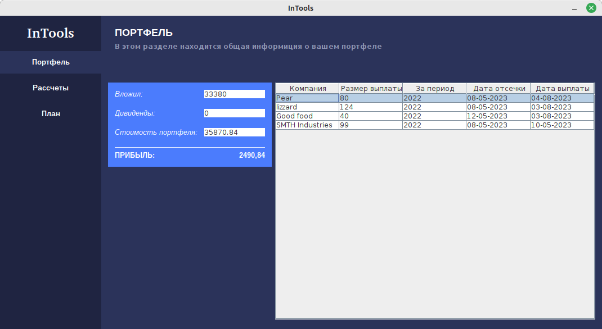

## InTools

InTools is an open source toolkit for investors that helps you plan and calculate your investment. It contains various tools that help investors make decisions about their investments.

### Сontains the following tools:
> One of the main tools is the investment planner. This tool helps investors plan their investments for a period of time. It allows you to determine how much money you need to invest each month in order to achieve a certain goal, such as creating a certain amount of capital or making a certain profit.

> Also in the application there is an investment portfolio calculator. It helps the investor calculate the return on his portfolio.

